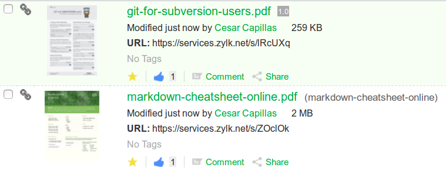

# Short URLs for Alfresco Share

This example is based in a previous work related to how to create a simple URL shortener for Alfresco Share. 

https://gist.github.com/agea/2779867

The original code shows instructions for enabling the component:
 - deploying dynamically a simple content model which defines a custom aspect and a custom property
 - creating a content rule for executing some javascript code for enabling the defined shortable aspect
 - an additional Apache rewrite rule is necessary for the URL shortener. 

I used this example in an Alfresco training to show different concepts such as content models and custom aspects, search and indexing, content rules and finally to introduce Alfresco Javascript API. In the next, we discuss a revision of the example adding:
 - A bootstrap configuration for dwModel.xml including i18n properties
 - A basic share form configuration
 - A simple JS action for creating short URLs with the help of content rules
 - A JS behaviour for generating a short URL when adding dw:shortable aspect
 - A custom metadata template for documents with dw:shortable aspect applied
 - A custom indicator for documents with dw:shortable aspect applied

and other useful concepts such as bootstrap (i18n) content models, actions, behaviours, metadata templates, evaluators and indicators.

## Using

Once applied aspect in Alfresco Share, for searching, just type @dw:shorturl:"OamhPP" in Alfresco search box or use the next url:

http://locahost:8080/share/page/search?t=dw:shorturl:OamhPP

## Packaging

You may pack it with jar command. Go into the directory that you unzipped, or cloned via git:

    $ git clone https://github.com/zylklab/zk-url-shortener
    $ cd zk-url-shortener
    $ jar -cf zk-url-shortener.jar *

Note: this jar would only work if Alfresco repo and Alfresco Share are deployed in the same Tomcat instance. 

## Installation

For installing, just copy the jar file in $TOMCAT/shared/lib and restart Alfresco

## Apache reverse proxy config and rewrite urls 

For using really short urls you need Apache in your config (for example, /etc/apache2/sites-enabled/000-default.conf):

    # Rewrite config for short urls
    RewriteEngine On
    RewriteRule ^/s/(.*)$ /share/page/search?t=dw:shorturl:$1 [R]

    # Reverse proxy config 
    RewriteRule ^/$ share [R]
    ProxyPass /alfresco         ajp://localhost:8009/alfresco 
    ProxyPassReverse /alfresco  ajp://localhost:8009/alfresco
    ProxyPass /share            ajp://localhost:8009/share 
    ProxyPassReverse /share     ajp://localhost:8009/share

For using urls like http://locahost/s/OamhPP

The previous config is enabled with the usual sudoer commands (in Ubuntu or Debian) :

    sudo a2enmod rewrite
    sudo a2enmod proxy
    sudo a2enmod proxy_ajp
    sudo service apache2 restart

## More things to do (in the training) :)
 - Ant file for generating jar file and local tasks for a local deployment
 - Use Alfresco Maven SDK 
 - Separate in two AMPs

## Tested

It should work in Alfresco 4.x and 5.x and Apache 2.2